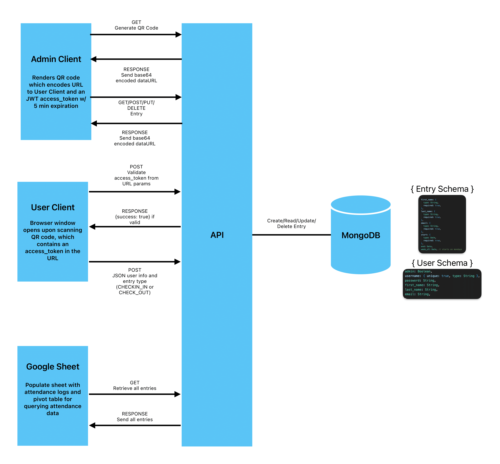

# VS Attendance API

### Overview

Node server API for logging attendance, generating QR codes, and validating access tokens. This service acts as an interface between a MongoDB database, google spreadsheet, and two client web applications:

- [User Client](https://github.com/bbgrabbag/vs-attendance-client-user.git)
- [Admin Client](https://github.com/bbgrabbag/vs-attendance-client-admin.git)
- Attendance Spreadsheet
  - [Prod](https://docs.google.com/spreadsheets/d/12T2-isdu6xNbipYujpXWjE6lnEGXTQmfxQbDvoB6wFQ/edit#gid=1779750210)
  - [QA](https://docs.google.com/spreadsheets/d/11VRQK2OnqzBCogqMBHV_wzyxvH8xhQc7V2VH2quoKyI/edit#gid=1779750210)

### Sytem Architecture



### Getting Started

```bash
# create and populate .env files (see .env.template file for reference)
touch .env .env.ci .env.qa
cat .env.template >> .env
cat .env.template >> .env.qa
cat .env.template >> .env.ci

# generate .env.vault (remember to run this whenever there is a change to an .env.* file)
npm run set-env

#create admin-user
npm run db:admin-user:create:dev

# start dev server
npm run dev

# run unit tests
npm t

# run linter
npm run lint

# run formatter
npm run format
```

### Database Scripts

```bash
# Note: <env> can be either qa, prod, or dev, each affecting their respective db environment. Script files can be found in /db/scripts/.

# Creates an admin user. Some endpoints require an admin_access_token to be sent on behalf of an admin user. These are acquired by logging in via the `api/auth/admin/login` route.
npm run db:admin-user:create:<env>

# Used for data mgiration tasks such as batch updating.
npm run db:migrate:<env>

# Populate database with mock data. DO NOT USE FOR PRODUCTION!
npm run db:seed:<env> # qa and dev only
```

### API Endpoints

```ts
type LogEntryType = "CHECK_IN" | "CHECK_OUT";
type LogEntryFields = {
  firstName: string;
  lastName: string;
  email: string;
};
type Entry = {
  first_name: string;
  last_name: string;
  email: string;
  start: string; //ISO8601 Date format
  end?: string; //ISO8601 Date format
  week_of?: string; //ISO8601 Date format
};
type AdminUser = {
  username: string;
  password: string;
};
type AdminClientConfig = {
  interval: number;
  latitude: number;
  longitude: number:
  maxRange: number;
}
```

| Method   | Path                                                 | Description                                                                                                                                                                                                                                                                                                                                                                                                | Headers                                          | Request Body (JSON)                              | Response Data (JSON)                      |
| -------- | ---------------------------------------------------- | ---------------------------------------------------------------------------------------------------------------------------------------------------------------------------------------------------------------------------------------------------------------------------------------------------------------------------------------------------------------------------------------------------------- | ------------------------------------------------ | ------------------------------------------------ | ----------------------------------------- |
| `GET`    | `/docs`                                              | Retrieve API documentation                                                                                                                                                                                                                                                                                                                                                                                 |                                                  |                                                  | `<html>`                                  |
| `POST`   | `/api/auth/admin/login`                              | Authenticates admin user and issues an `<admin_access_token>`.                                                                                                                                                                                                                                                                                                                                             |                                                  | `{ user: AdminUser }`                            | `{ success: true, access_token: string }` |
| `GET`    | `/api/qr-code/config`                                | Provides configuration settings for the admin client                                                                                                                                                                                                                                                                                                                                                       |                                                  |                                                  | `{ config: AdminClientConfig }`           |
| `GET`    | `/api/qr-code/generate`                              | Provides a dataURL of a QR code which encodes the User Client website URL and time-limited `user_access_token`: `https://<client_url>?access_token=<user_access_token>`. Will throw a `InvalidLocation` error if geolocation check fails.                                                                                                                                                                                                                                    |                                                  |                                                  | `{ dataUrl: string }`                     |
| `GET`    | `/api/qr-code/validate`                              | Validates provided `user_access_token`                                                                                                                                                                                                                                                                                                                                                                     | `{ Authorization: Bearer <user_access_token>}`   |                                                  | `{ success:true }`                        |
| `GET`    | `/api/attendance/entries?&email=<string\|undefined>` | Retrieves filtered `Entry` records. Omit query parameters for all records.                                                                                                                                                                                                                                                                                                                                 |                                                  |                                                  | `{ success: true, entries:Entry[] }`      |
| `POST`   | `/api/attendance/log-entry`                          | If `CHECK_IN` type is provided, a new timestamped `Entry` is created with `start` set to time of creation. Automatically sets `week_of` to the Monday prior to timestamp. For `CHECK_OUT` types, the most recent `Entry` belonging to record with given `email` is updated with `end` set to current time. If no records are found or lastest entry has already been checked out, an error will be thrown. | `{ Authorization: Bearer <user_access_token> }`  | `{ fields: LogEntryFields, type: LogEntryType }` | `{ success:true, entry: Entry }`          |
| `PUT`    | `/api/attendance/entries/:id`                        | Updates `Entry` Record with provided `id`.                                                                                                                                                                                                                                                                                                                                                                 | `{ Authorization: Bearer <admin_access_token> }` | `{ fields: Entry }`                              | `{ success: true, entry: Entry }`         |
| `DELETE` | `/api/attendance/entries/:id`                        | Deletes `Entry` Record with provided `id`. If `start` is provided, a new `week_of` date will be calculated based on the previous Monday.                                                                                                                                                                                                                                                                   | `{ Authorization: Bearer <admin_access_token> }` |                                                  | `{ success: true, entryId: string }`      |
| `POST`   | `/api/attendance/entries`                            | Creates `Entry` Record. Required fields are `first_name`,`last_name`,`email`, and `start`                                                                                                                                                                                                                                                                                                                  | `{ Authorization: Bearer <admin_access_token> }` | `{ fields: Entry }`                              | `{ success: true, entry: Entry }`         |
